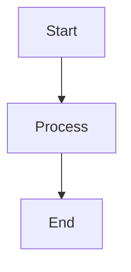

# SDI Documentation

This is the documentation site for SDI (Synthetic Digital Immunity), built with [Nextra](https://nextra.site) - a Next.js-based documentation framework.

## Features

- ✨ **Minimalist UI**: Clean, Stripe-inspired design
- 📝 **MDX Support**: Write documentation with React components
- 🔢 **Math Rendering**: KaTeX for mathematical equations
- 📊 **Diagrams**: Mermaid.js for flowcharts, sequence diagrams, and more
- 💻 **Code Highlighting**: Prism.js with GitHub-style themes
- 🔍 **Search**: Built-in full-text search
- 🌙 **Dark Mode**: Automatic dark/light theme support

## Getting Started

### Install Dependencies

```bash
npm install
```

### Development Server

```bash
npm run dev
```

Open [http://localhost:3000](http://localhost:3000) in your browser.

### Build for Production

```bash
npm run build
npm start
```

## Documentation Structure

```
/docs
  ├── pages/
  │   ├── index.mdx          # Abstract & Quick Start
  │   ├── architecture.mdx   # System Architecture
  │   ├── methodology.mdx    # Methodology & Math
  │   ├── code-samples.mdx   # Code Samples
  │   ├── diagrams.mdx       # Diagrams & Visuals
  │   ├── evaluation.mdx     # Evaluation & Metrics
  │   ├── references.mdx     # References
  │   └── downloads.mdx      # Downloads & Resources
  ├── public/
  │   ├── Synthetic_Digital_Immunity_IEEE_Style.pdf
  │   └── Synthetic Digital Immunity (SDI) Architecture Diagrams.pdf
  ├── styles/
  │   └── custom.css         # Custom styling
  ├── theme.config.tsx       # Theme configuration
  └── next.config.js         # Next.js configuration
```

## Research Papers & PDFs

The documentation includes downloadable PDFs:

- **IEEE Style Research Paper**: Complete academic paper with methodology and evaluation
- **Architecture Diagrams**: Comprehensive system architecture documentation

Access these from the [Downloads & Resources](/downloads) page.

## Writing Documentation

### Math Equations

Use KaTeX syntax for math:

```markdown
Inline math: $E = mc^2$

Block math:
$$
S(x) = \sum_{i=1}^{n} w_i \cdot f_i(x)
$$
```

### Diagrams

Use Mermaid syntax:

````markdown

````

### Code Blocks

Use standard markdown code fences:

````markdown
```java
public class Example {
    // Your code here
}
```
````

## Customization

- **Theme**: Edit `theme.config.tsx`
- **Styling**: Edit `styles/custom.css`
- **Navigation**: Edit `pages/_meta.json`

## Deployment

### Vercel (Recommended)

[](https://vercel.com/new/clone?repository-url=https://github.com/skesani/sdi)

### Other Platforms

The site can be deployed to any platform that supports Next.js:
- Netlify
- AWS Amplify
- GitHub Pages (with static export)
- Docker

## License

Apache-2.0

