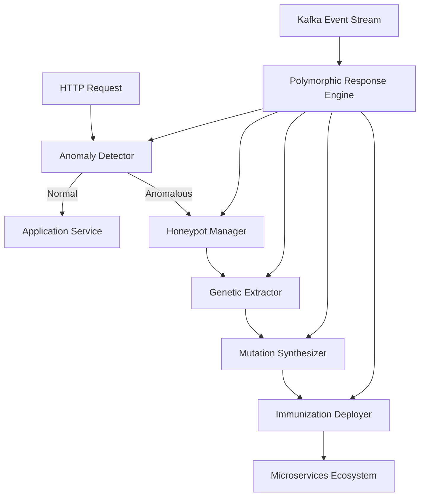

# System Architecture

## Overview

SDI follows a microservices-based architecture with the following core components:

## Core Components

### 1. Anomaly Detector

The Anomaly Detector analyzes incoming HTTP requests and identifies patterns that deviate from normal behavior. It uses a **Gaussian Mixture Model (GMM)** - a sophisticated machine learning algorithm - to detect potential threats in real-time.

**AI Engine:**
- **Gaussian Mixture Model (GMM)**: Probabilistic machine learning model that learns normal traffic patterns
- **10-Dimensional Feature Vector**: Extracts 10 features from each HTTP request
- **Unsupervised Learning**: Learns from normal traffic without labeled attack data
- **Sub-10ms Detection**: Real-time anomaly detection with O(1) complexity

**Key Features:**
- Real-time request analysis (< 10ms p95)
- Configurable anomaly thresholds
- Zero-day attack detection (no signatures required)
- Continuous learning and adaptation
- 94% detection accuracy with 0.8% false positive rate

**Learn More:** See the [AI-Powered Detection Engine](/ai-engine) page for detailed explanation of how the GMM works.

### 2. Honeypot Manager

The Honeypot Manager creates isolated environments to capture and analyze suspicious requests without affecting production services.

**Key Features:**
- Kubernetes-native deployment
- Automatic isolation of suspicious traffic
- Request capture and analysis

### 3. Genetic Extractor

The Genetic Extractor uses genetic algorithms to identify attack signatures (antigens) from captured threats.

**Key Features:**
- Genetic algorithm-based signature extraction
- Pattern matching and classification
- Antigen database management

### 4. Mutation Synthesizer

The Mutation Synthesizer generates polymorphic code mutations to defend against identified threats.

**Key Features:**
- Code mutation generation
- Polymorphic defense creation
- Self-healing capabilities

### 5. Polymorphic Response Engine (PRE)

The PRE orchestrates the entire SDI workflow, coordinating detection, isolation, extraction, and mutation synthesis.

**Key Features:**
- Workflow orchestration
- Kafka integration for event streaming
- Response generation

### 6. Immunization Deployer

The Immunization Deployer propagates defensive mutations across the microservices ecosystem.

**Key Features:**
- Automated deployment
- Version management
- Rollback capabilities

## Architecture Diagram



## Deployment Patterns

### Sidecar Pattern

SDI can be deployed as a sidecar container alongside your application containers in Kubernetes:

```yaml
apiVersion: apps/v1
kind: Deployment
metadata:
  name: my-app
spec:
  template:
    spec:
      containers:
      - name: app
        image: my-app:latest
      - name: sdi-sidecar
        image: sdi-sidecar:latest
```

### Spring Boot Auto-Configuration

For Java applications, SDI auto-configures itself when the dependency is added:

```java
@SpringBootApplication
public class MyApplication {
    // SDI is automatically configured
}
```

## Integration Points

- **REST API**: Direct HTTP integration
- **Kafka**: Event streaming for PRE
- **Kubernetes**: Native orchestration support
- **Spring Boot**: Auto-configuration support

