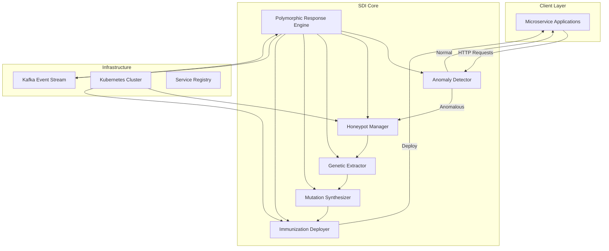
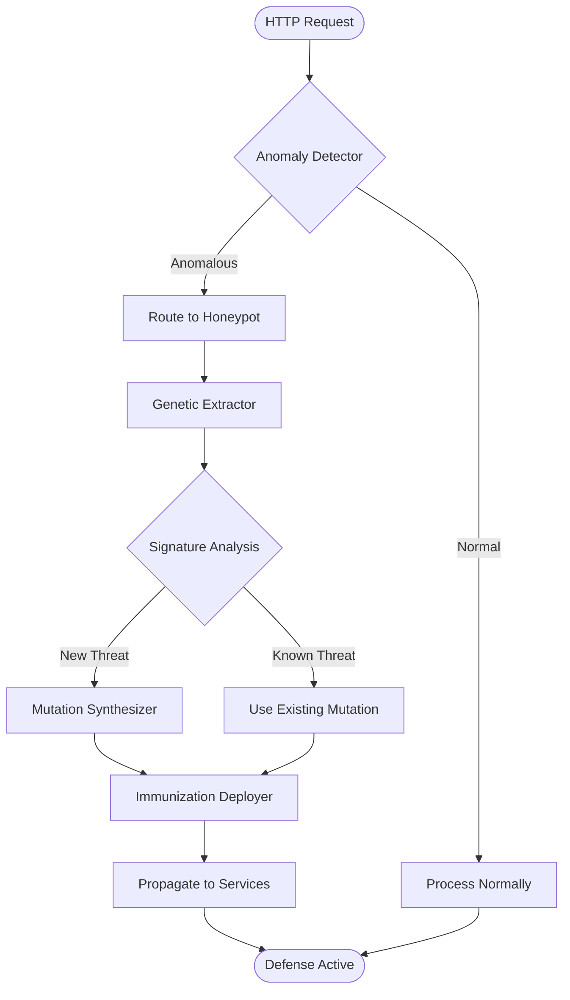
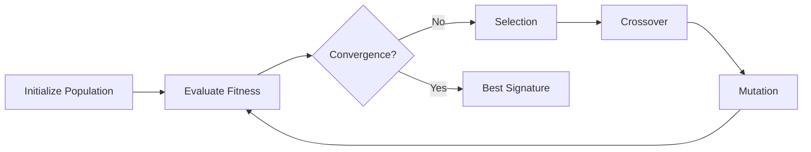
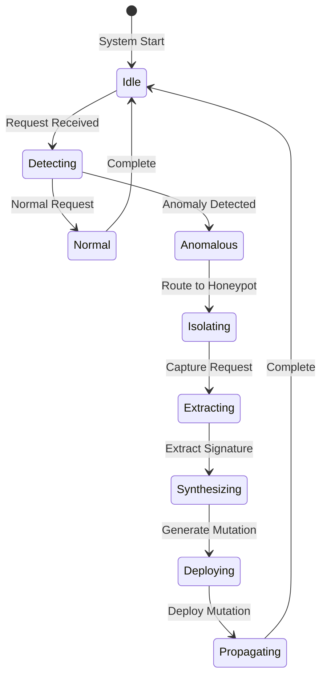
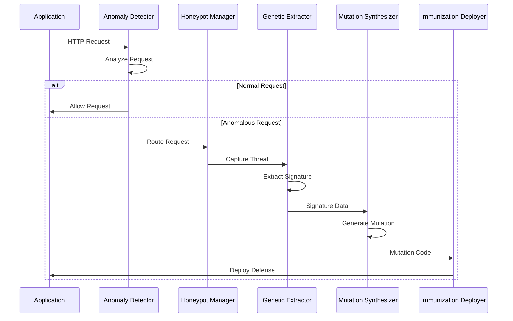
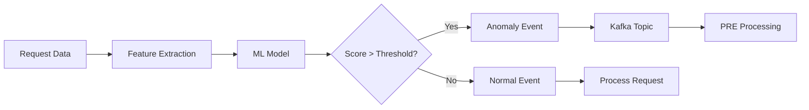
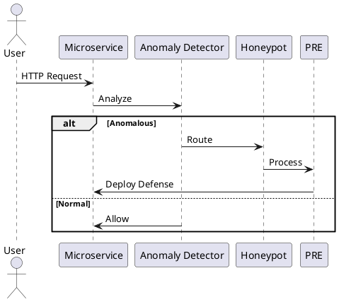

# Diagrams & Visuals

## System Architecture

### High-Level Architecture



## PRE Pipeline Flow



## Genetic Algorithm Flow



## State Diagram



## Component Interaction



## Data Flow



## Figures

The following figures are available in the `/diagrams` directory:

- **Figure 1**: SDI Architecture (`figure1_sdi_architecture.png`)
- **Figure 2**: PRE Pipeline (`figure2_pre_pipeline.png`)
- **Figure 3**: GA Convergence (`figure3_ga_convergence.png`)
- **Figure 4**: Mutation Topology (`figure4_mutation_topology.png`)

### Embedding Images

You can reference these figures in your documentation:

```markdown

```

## Architecture Diagrams PDF

For comprehensive architecture documentation, see:

📄 **[SDI Architecture Diagrams PDF](/Synthetic%20Digital%20Immunity%20(SDI)%20Architecture%20Diagrams.pdf)**

This PDF contains detailed architectural diagrams, system design documentation, and visual representations of all SDI components and their interactions.

## PlantUML Alternative

If you prefer PlantUML syntax, you can use it with draw.io or convert to Mermaid:



