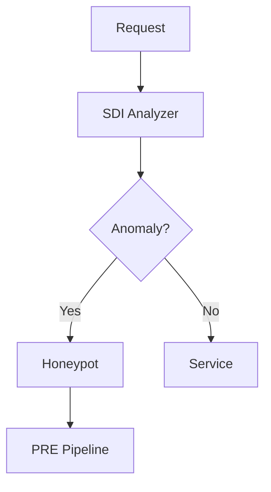

# Generating Diagrams for Documentation

## Quick Setup

1. Install dependencies:
```bash
pip3 install matplotlib numpy
```

2. Generate diagrams:
```bash
cd diagrams
python3 generate_figures.py
```

3. Copy to documentation:
```bash
cp *.png ../documentation/static/images/
```

## Required Images

The documentation references these images (place them in `documentation/static/images/`):

- `sdi-architecture.png` - Overall SDI architecture showing components
- `sdi-pipeline.png` - PRE pipeline flow (5 phases)
- `sidecar-pattern.png` - Kubernetes sidecar deployment diagram
- `analysis-flow.png` - Analysis endpoint request/response flow
- `request-flow.png` - Request processing through SDI
- `quick-start.png` - Quick start visual guide

## Creating Screenshots

### Architecture Diagram
Show:
- SDI Core components
- Sidecar pattern
- Kubernetes integration
- Kafka event bus
- Microservices

### Pipeline Flow
Show the 5 phases:
1. Detection
2. Isolation
3. Antigen Extraction
4. Mutation Synthesis
5. Propagation

### Sidecar Pattern
Show:
- Pod with main container
- SDI sidecar container
- Network flow between them

## Tools

- **Draw.io** (diagrams.net) - Free, web-based
- **Mermaid** - Code-based diagrams (can embed in markdown)
- **PlantUML** - Text-based UML diagrams
- **Excalidraw** - Hand-drawn style diagrams

## Mermaid Example

You can also use Mermaid diagrams directly in markdown:



